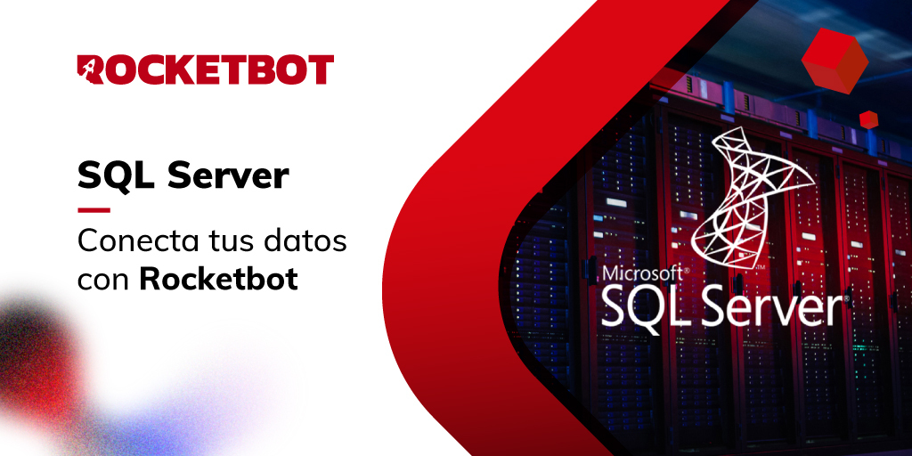

# SQLServer
  
Conecte-se ao SQL Server e gerencie todos os seus bancos de dados, execute consultas personalizadas, importe e exporte dados, crie e execute procedimentos armazenados.  

*Read this in other languages: [English](Manual_SQLServer_.md), [Português](Manual_SQLServer_.pr.md), [Español](Manual_SQLServer_.es.md)*
  

## Como instalar este módulo
  
Para instalar o módulo no Rocketbot Studio, pode ser feito de duas formas:
1. Manual: __Baixe__ o arquivo .zip e descompacte-o na pasta módulos. O nome da pasta deve ser o mesmo do módulo e dentro dela devem ter os seguintes arquivos e pastas: \__init__.py, package.json, docs, example e libs. Se você tiver o aplicativo aberto, atualize seu navegador para poder usar o novo módulo.
2. Automático: Ao entrar no Rocketbot Studio na margem direita você encontrará a seção **Addons**, selecione **Install Mods**, procure o módulo desejado e aperte instalar.  

## Descrição do comando

### Conexão com SQLServer
  
Conectar ao banco de dados SQLServer
|Parâmetros|Descrição|exemplo|
| --- | --- | --- |
|Sessão||Conn1|
|Server||DESKTOP-T2319IB\SQLEXPRESS|
|Nome do BD||test|
|Usuário do BD||usertest|
|Senha do BD||passtest|

### Consulta SQLServer
  
Faça uma consulta a um banco de dados do SQLServer
|Parâmetros|Descrição|exemplo|
| --- | --- | --- |
|Consulta SQL||select * from test|
|Sessão||Conn1|
|Assign to var||Variable|

### Exportar dados
  
Exportar dados de um banco de dados SQLServer
|Parâmetros|Descrição|exemplo|
| --- | --- | --- |
|Sessão||Conn1|
|Consulta SQL||select * from test|
|Caminho de arquivo||Caminho|
|Caminho do arquivo base||Caminho|
|Nome da folha||Folha1|
|Celula||Celula|

### Importar dados
  
Importar dados para um banco de dados SQLServer
|Parâmetros|Descrição|exemplo|
| --- | --- | --- |
|Sessão||Conn1|
|Nome da folha||Folha1|
|Nome da tabela a importar||Tabela|
|Caminho do arquivo base||Caminho|
|Tamanho do batch|As linhas serão gravadas em lotes desse tamanho por vez. Por padrão, todas as linhas serão gravadas de uma só vez.|2000|
|Método|||

### Crie um SP com variáveis
  
Crie um Store Procedure com variáveis
|Parâmetros|Descrição|exemplo|
| --- | --- | --- |
|Sessão||Conn1|
|Nome de SP||TestDB_GetAll|
|Variáveis de SP||@LastName nvarchar(50), @FirstName nvarchar(50)|
|Query||SELECT * FROM dbo.Table WHERE LastName = @LastName AND FirstName = @FirstName|

### Obter SPs
  
Obtenha os Store Procedures disponíveis
|Parâmetros|Descrição|exemplo|
| --- | --- | --- |
|Sessão||Conn1|
|Assign to var||Variable|

### SP para executar
  
Para ver os SPs, você deve se conectar ao DB sem fechar a conexão até selecionar o Store Procedure
|Parâmetros|Descrição|exemplo|
| --- | --- | --- |
|Selecione o SP|||
|Sessão||Conn1|
|Assign to var||Variable|

### Excluir um SP
  
Exclua o Store Procedure indicado
|Parâmetros|Descrição|exemplo|
| --- | --- | --- |
|Sessão||Conn1|
|Nome de SP||TestDB_GetAll|

### Desligar conexão
  
Desligar a conexão com SQLServer
|Parâmetros|Descrição|exemplo|
| --- | --- | --- |
|Sessão||Conn1|
